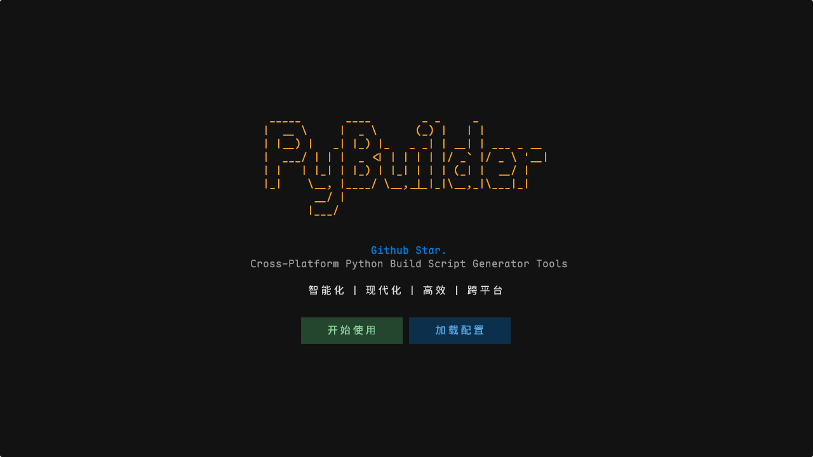
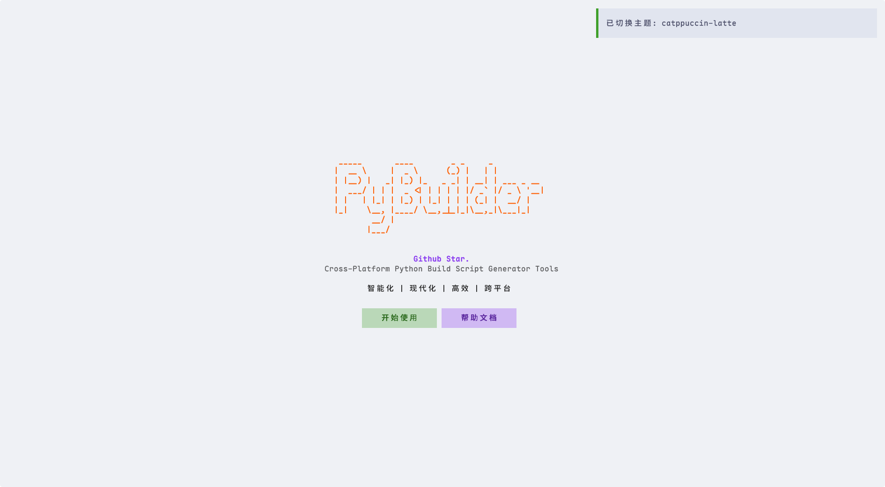

# PyBuild-Generate

<div align="center">

```
  _____       ____        _ _     _           
 |  __ \     |  _ \      (_) |   | |          
 | |__) |   _| |_) |_   _ _| | __| | ___ _ __ 
 |  ___/ | | |  _ <| | | | | |/ _` |/ _ \ '__|
 | |   | |_| | |_) | |_| | | | (_| |  __/ |   
 |_|    \__, |____/ \__,_|_|_|\__,_|\___|_|   
         __/ |                                
        |___/                                 
```


**跨平台 Python 编译脚本生成器**

[](https://www.python.org/)
[](LICENSE)
[]()

</div>

## 特性

- 🎨 **现代 TUI 界面** - 基于 Textual 构建，支持 8 种主题切换
- 📦 **双打包工具** - 支持 PyInstaller 和 Nuitka
- ⚙️ **可视化配置** - 图形化配置编译选项，自动生成构建脚本
- 🚀 **CI/CD 集成** - GitHub Actions 自动构建
- 💾 **配置持久化** - 自动保存项目配置和用户偏好

## 截图

<div align="center">

### 主界面


### 功能展示
<table>
  <tr>
    <td width="50%">
      
    </td>
    <td width="50%">
      
    </td>
  </tr>
  <tr>
    <td width="50%">
      
    </td>
    <td width="50%">
      
    </td>
  </tr>
</table>

</div>

## 快速开始

### 安装依赖

```bash
# 使用 uv (推荐)
uv sync
```

### 运行

```bash
# 使用 uv
uv run main.py
```

### 构建可执行文件

```bash
# 使用Nuitka
uv run build_nuitka.py

# 使用Pyinstaller
uv run build_pyinstaller.py
```

构建产物将输出到 `build/` 目录。

## 快捷键

| 快捷键 | 功能 |
|--------|------|
| `F1` | textual-dark 主题 |
| `F2` | gruvbox 主题 |
| `F3` | dracula 主题 |
| `F4` | monokai 主题 |
| `F5` | flexoki 主题 |
| `F6` | tokyo-night 主题 |
| `F7` | catppuccin-latte 主题 |
| `F8` | textual-light 主题 |
| `ESC` | 返回上一步 |
| `Ctrl+C` | 退出程序 |
| `Ctrl+S` | 保存配置 |


## 配置文件

程序会在运行目录下生成 `config.yaml` 配置文件：

```yaml
theme: textual-dark      # 界面默认主题
terminal_min_cols: 112   # 最小终端宽度
terminal_min_rows: 32    # 最小终端高度
```

## CI/CD 自动构建

提交信息包含特定前缀时自动触发构建：

```bash
git commit -m "build_0: 更新"  # 触发 PyInstaller 构建
git commit -m "build_1: 更新"  # 触发 Nuitka 构建
```

构建产物在 Actions → Artifacts 下载，保留 7 天。

## 项目结构

```
PyBuild-Generate/
├── main.py                   # 程序入口
├── build_*.py                # 构建脚本
├── src/
│   ├── app.py                # 主应用
│   ├── screens/              # 8个界面屏幕
│   └── utils/                # 工具模块
├── .github/workflows/        # CI/CD 配置
└── assets/                   # 资源文件
```

## 依赖

- Python >= 3.12
- textual >= 0.47.0
- rich >= 13.0.0
- pydantic >= 2.0.0
- pyfiglet >= 1.0.4
- nuitka >= 2.8.6
- pyinstaller >= 6.17.0

## License

MIT License © [ASLant](https://github.com/Y-ASLant)

## 贡献

欢迎提交 Issue 和 Pull Request！

---

<div align="center">
  <sub>Made with love by ASLant</sub>
</div>
